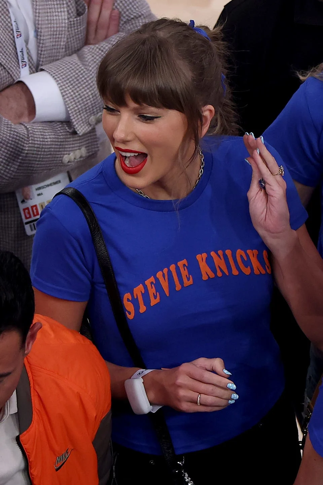

<div align="center">

# 🗽 Knicks Shirt Maker

**Make your own custom Knicks-style tee — inspired by the shirt Taylor Swift wore courtside at Madison Square Garden during the 2026 NBA Finals.**



*The shirt that started it all — Game 4, NBA Finals, MSG, June 2026*

</div>

---

## Demo

<video src="assets/demo.mov" controls width="100%"></video>

> **Note:** If the video doesn't render above, [click here to watch the demo](assets/demo.mov).

---

## What it does

Type any text and it appears on a Knicks blue t-shirt with arched orange lettering — exactly like the viral custom shirts from the Finals. Download your design as a PNG, or on iPhone long-press the image to save it to your photos.

---

## Features

- **Live preview** — shirt updates as you type
- **Arched jersey text** — parabolic warp preserves natural font kerning (no janky character spacing)
- **Download** — PNG on desktop, long-press save on iOS
- **Soundtrack** — New York Groove plays on first interaction
- **Zero dependencies** — pure HTML, CSS, and vanilla JS. No build step.
- **GitHub Pages ready** — drop the files in a repo and ship

---

## Usage

```
1. Type your text in the input field
2. Watch it appear on the shirt in real time
3. Hit "Download Shirt" to save your PNG
```

### Run locally

Open `index.html` directly in your browser — no server required.

### Deploy to GitHub Pages

1. Push this repo to GitHub
2. Go to **Settings → Pages**
3. Set source to `main` branch, `/ (root)`
4. Done — live at `https://yourusername.github.io/knicks-shirt-maker`

---

## Project structure

```
knicks-shirt-maker/
├── index.html      # Markup only
├── styles.css      # CSS custom properties, no preprocessor
├── shirt.js        # Canvas rendering + iOS-aware download
├── player.js       # SoundCloud widget + autoplay fallback
└── assets/
    ├── demo.mov
    └── inspiration.webp
```

---

## Tech notes

- **Arched text** is rendered by warping a full offscreen canvas column-by-column with a parabolic y-shift. Per-character arc approaches break font kerning (narrow letters like `I` end up with uneven gaps); the pixel-warp preserves it perfectly.
- **iOS download** detects Safari on iPhone/iPad and opens the image in a new tab for long-press saving, since iOS ignores the `download` attribute on anchor elements.
- **Autoplay** fires on the first user interaction with the page if the browser blocks it on load.

---

<div align="center">

Go Knicks 💙🧡 Let's Go New York

Made by [@reubeningber](https://instagram.com/reubeningber)

</div>
